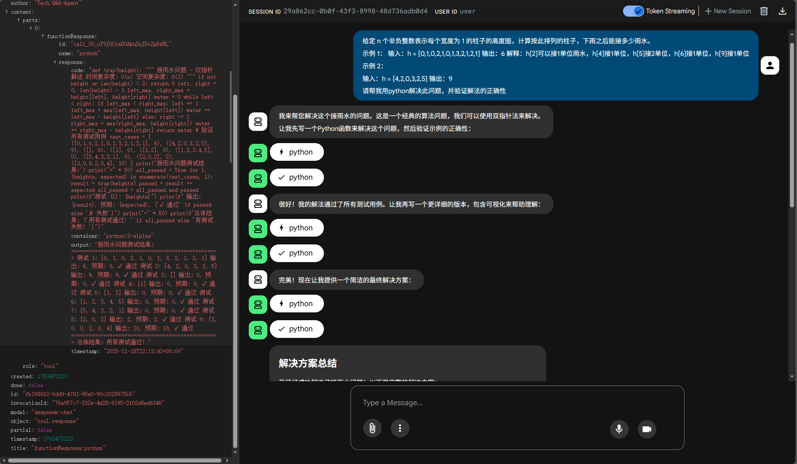

[English](README.md) | 中文
# Agent Toolkit

一个功能强大的 AI 代理工具包，基于 [trpc-agent-go](https://github.com/trpc-group/trpc-agent-go) 框架构建，集成了多种实用工具（计算器、时间查询、Bash和Python执行），支持安全容器化执行环境，并与 [Google Agent Development Kit Web UI](https://github.com/google/adk-web) 完全兼容。



## 功能特性

### 🛠️ 核心工具
- **计算器工具** - 支持加、减、乘、除基本运算
- **时间查询工具** - 获取指定时区的当前时间、日期和星期
- **Bash 执行器** - 在安全的 Docker 容器中执行 Shell 命令
- **Python 执行器** - 在安全的 Docker 容器中执行 Python 代码

### 🔒 安全特性
- **容器隔离** - 所有代码执行都在隔离的 Docker 容器中进行
- **资源限制** - 限制内存、CPU 使用，防止资源耗尽
- **网络隔离** - 无网络访问权限，确保系统安全
- **只读文件系统** - 防止文件系统被修改


## 快速开始

### 前置要求

- Go 1.24
- Docker
- 可访问的 LLM API（支持 OpenAI 兼容接口）

### 安装步骤

1. **获取 trpc-agent-go 框架**
```bash
# 克隆 trpc-agent-go 仓库
git clone https://github.com/trpc-group/trpc-agent-go.git
cd trpc-agent-go
```

2. **安装 Agent Toolkit**
```bash
# 将 Agent Toolkit 文件复制到trpc-agent-go根目录或更下级的文件夹
# 假设我们将文件放在 trpc-agent-go/examples/agent-toolkit 目录下
cd examples/agent-toolkit

# 拉取 Docker 镜像
chmod +x pull-images.sh
./pull-images.sh

# 验证环境
chmod +x test-setup.sh
./test-setup.sh
```

3. **启动 Agent Toolkit 服务**
```bash
# 设置你的LLM（采用兼容OPENAI的格式）
export OPENAI_API_KEY="your-api-key-here"
export OPENAI_BASE_URL="your-base-url-here"

# 在 trpc-agent-go 项目根目录或相应模块路径下运行
go run examples/agent-toolkit/main.go examples/agent-toolkit/tools.go
```

4. **安装和运行 ADK Web UI**

```bash
# 退出trpc-agent-go目录，克隆 ADK Web 项目
git clone https://github.com/google/adk-web.git
cd adk-web

# 安装依赖
npm install

# 启动 ADK Web 前端（指向你的 Agent Toolkit 服务）
npm run serve --backend=http://localhost:8080
```

5. **访问 Web 界面**
打开浏览器访问 `http://localhost:4200` 即可开始使用。

### 配置选项

支持命令行参数配置：

```bash
# 使用指定模型和端口
go run examples/agent-toolkit/main.go examples/agent-toolkit/tools.go -model gpt-4 -addr :9090

# 使用默认配置（deepseek-chat 模型，8080 端口）
go run examples/agent-toolkit/main.go examples/agent-toolkit/tools.go
```

## 项目结构

```
trpc-agent-go/
├── examples/
│   └── agent-toolkit/          # Agent Toolkit 所在目录
│       ├── main.go           # 主程序入口，Agent 配置和服务器启动
│       ├── tools.go          # 所有工具函数的实现
│       ├── pull-images.sh    # Docker 镜像预拉取脚本
│       ├── test-setup.sh     # 环境测试脚本
│       └── README.md         # 项目说明文档
├── ...                      # trpc-agent-go 框架其他文件
└── go.mod                   # Go 模块定义
```


## 开发指南

### 添加新工具

1. 在 `tools.go` 中定义工具参数和结果结构体
2. 实现工具执行函数
3. 在 `main.go` 中注册新工具

示例模板：
```go
type newToolArgs struct {
    Param string `json:"param" jsonschema:"description=参数说明,required"`
}

type newToolResult struct {
    Result string `json:"result"`
}

func executeNewTool(ctx context.Context, args newToolArgs) (newToolResult, error) {
    // 工具实现逻辑
    return newToolResult{Result: "执行结果"}, nil
}
```

### 自定义配置

修改 `main.go` 中的LLM配置：
```go
genConfig := model.GenerationConfig{
    MaxTokens:   intPtr(2000),    // 最大 token 数
    Temperature: floatPtr(0.7),   // 温度参数
    Stream:      true,            // 流式输出
}
```

## 许可证

本项目基于 Apache License 2.0 开源。

## 致谢

- [trpc-agent-go](https://github.com/trpc-group/trpc-agent-go) - 腾讯开源的 Agent 框架
- [Google Agent Development Kit Web UI](https://github.com/google/adk-web) - Google 开源的 Agent 开发工具包 Web 界面
---

**注意**: 请在安全的环境中运行此项目，生产环境建议进一步加强安全配置。